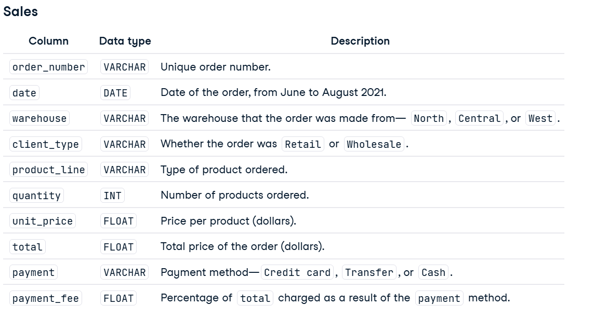
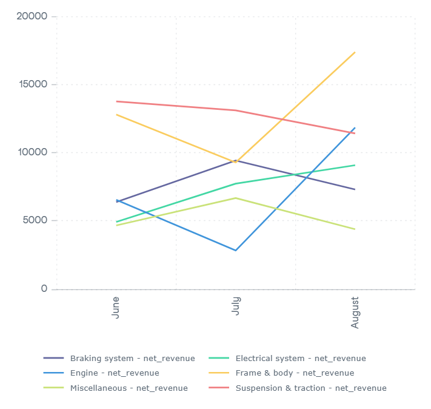
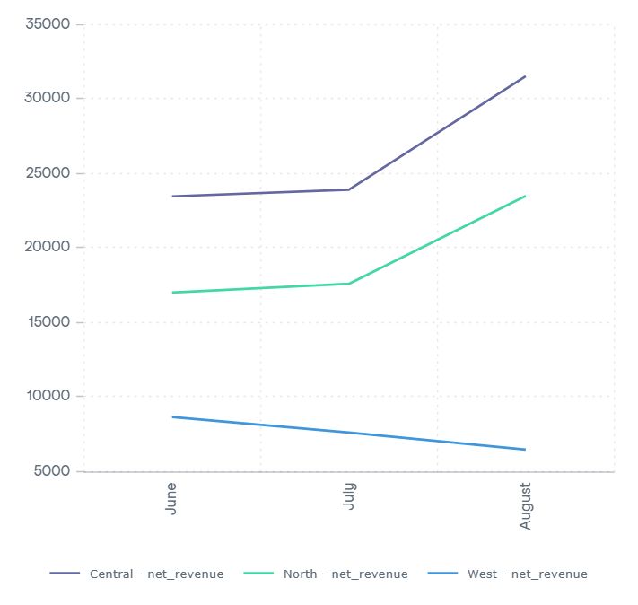
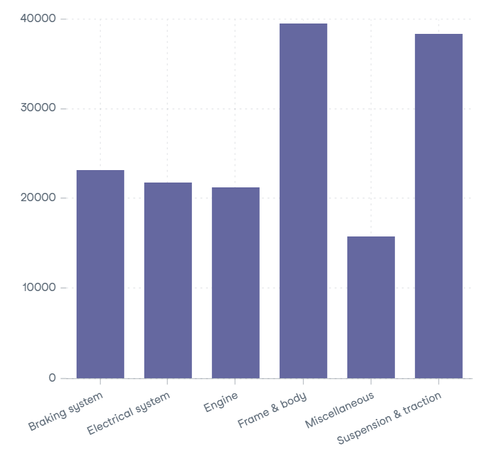
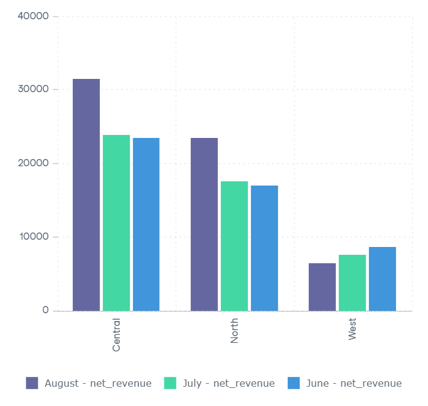
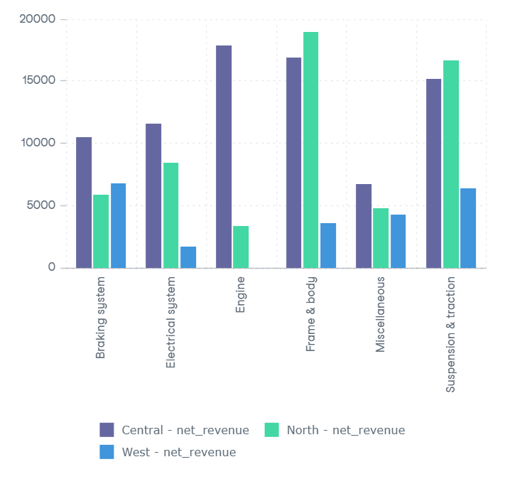

# Project: Analyzing Motorcycle Part Sales

## Project Descriptions:
You're working for a company that sells motorcycle parts, and they've asked for some help in analyzing their sales data!

They operate three warehouses in the area, selling both retail and wholesale. They offer a variety of parts and accept credit cards, cash, and bank transfer as payment methods. However, each payment type incurs a different fee.

The board of directors wants to gain a better understanding of wholesale revenue by product line, and how this varies month-to-month and across warehouses. You have been tasked with calculating net revenue for each product line and grouping results by month and warehouse. The results should be filtered so that only "Wholesale" orders are included.

They have provided you with access to their database, which contains the following table called sales:



## Project Instructions:
Find out **how much Wholesale net revenue each product_line generated per month per warehouse** in the dataset.

The query should be saved as revenue_by_product_line using the SQL cell provided, and contain the following:
- product_line
- month: displayed as 'June', 'July', and 'August'
- warehouse
- net_revenue: the sum of total minus the sum of payment_fee.

The results should be sorted by product_line and month, followed by net_revenue in descending order.

## Project Data

```sql
SELECT
	product_line,
	month,
	warehouse,
	net_revenue
FROM (
	SELECT 
		product_line,
		TO_CHAR(date,'FMMonth') AS month,
		EXTRACT(MONTH FROM date) AS num_month,
		warehouse,
		SUM(total-payment_fee) AS net_revenue
	FROM public.sales
	WHERE client_type = 'Wholesale' AND
		EXTRACT(MONTH FROM date) BETWEEN 6 AND 8
	GROUP BY 
		product_line,
		month,
		num_month,
		warehouse
) AS sub
ORDER BY 
	product_line,
	num_month,
	net_revenue DESC
;
```
| index | product_line         | month   | warehouse | net_revenue |
|-------|----------------------|---------|-----------|-------------|
| 0     | Braking system       | June    | Central   | 3684.89     |
| 1     | Braking system       | June    | North     | 1487.77     |
| 2     | Braking system       | June    | West      | 1212.75     |
| 3     | Braking system       | July    | Central   | 3778.65     |
| 4     | Braking system       | July    | West      | 3060.93     |
| 5     | Braking system       | July    | North     | 2594.44     |
| 6     | Braking system       | August  | Central   | 3039.41     |
| 7     | Braking system       | August  | West      | 2500.67     |
| 8     | Braking system       | August  | North     | 1770.84     |
| 9     | Electrical system    | June    | Central   | 2904.93     |
| 10    | Electrical system    | June    | North     | 2022.5      |
| 11    | Electrical system    | July    | Central   | 5577.62     |
| 12    | Electrical system    | July    | North     | 1710.13     |
| 13    | Electrical system    | July    | West      | 449.46      |
| 14    | Electrical system    | August  | North     | 4721.12     |
| 15    | Electrical system    | August  | Central   | 3126.43     |
| 16    | Electrical system    | August  | West      | 1241.84     |
| 17    | Engine               | June    | Central   | 6548.85     |
| 18    | Engine               | July    | Central   | 1827.03     |
| 19    | Engine               | July    | North     | 1007.14     |
| 20    | Engine               | August  | Central   | 9528.71     |
| 21    | Engine               | August  | North     | 2324.19     |
| 22    | Frame & body         | June    | Central   | 5111.34     |
| 23    | Frame & body         | June    | North     | 4910.12     |
| 24    | Frame & body         | June    | West      | 2779.74     |
| 25    | Frame & body         | July    | North     | 6154.61     |
| 26    | Frame & body         | July    | Central   | 3135.13     |
| 27    | Frame & body         | August  | Central   | 8657.99     |
| 28    | Frame & body         | August  | North     | 7898.89     |
| 29    | Frame & body         | August  | West      | 829.69      |
| 30    | Miscellaneous        | June    | West      | 2280.97     |
| 31    | Miscellaneous        | June    | Central   | 1878.07     |
| 32    | Miscellaneous        | June    | North     | 513.99      |
| 33    | Miscellaneous        | July    | Central   | 3118.44     |
| 34    | Miscellaneous        | July    | North     | 2404.65     |
| 35    | Miscellaneous        | July    | West      | 1156.8      |
| 36    | Miscellaneous        | August  | North     | 1841.4      |
| 37    | Miscellaneous        | August  | Central   | 1739.76     |
| 38    | Miscellaneous        | August  | West      | 813.43      |
| 39    | Suspension & traction| June    | North     | 8065.74     |
| 40    | Suspension & traction| June    | Central   | 3325.0      |
| 41    | Suspension & traction| June    | West      | 2372.52     |
| 42    | Suspension & traction| July    | Central   | 6456.72     |
| 43    | Suspension & traction| July    | North     | 3714.28     |
| 44    | Suspension & traction| July    | West      | 2939.32     |
| 45    | Suspension & traction| August  | Central   | 5416.7      |
| 46    | Suspension & traction| August  | North     | 4923.69     |
| 47    | Suspension & traction| August  | West      | 1080.79     |

## Project Result

### Trend Analysis
Goal: Understand how net revenue changes over time.

#### 1. Monthly Net Revenue by Product Line 


 - **Engine, Frame & body and Electrical System** show **an upward trend** from June to August.
 - In contrast, **Braking system, Suspension & traction and Miscellaneous** show **a declining trend** during the same period.

#### 2. Monthly Net Revenue by Warehouse


- **Central and North** experience **significant net revenue growth** during June to August as opposed to **West** who declines.

### Comparison
Goal: Compare values across categories.

#### 1. Product Lines by Net Revenue


- Both **Frame & Body** and **Suspension & traction** lead in the **net revenue** compared to other products.

#### 2. Net Revenue by Warehouse


- **Central** branch consistently generate **the highest net revenue** across June to August.

#### 3. Product Line Net Revenue by Warehouse


- Net revenue of **Engine** is heavily concentrated in **Central** 
- **Electrical system, Frame & body and Suspension & traction** depend heavily in **Central & North**
- **Braking system and Miscellaneous** have a more even distribution across all branches.

### Clustering

#### 1. Net Revenue Heatmap by Product Line vs Warehouse


- **Central** dominates each product line, especially in **Engine, Frame & Body and Suspension & traction.**
- **North** also rely on **Frame & Body and Suspension & traction.**
- **West** lags behind in all products.

## Conclusion

- **Frame & body and Suspension & traction** are the top revenue drivers. However, **Suspension & traction** is declining while **Engine** is growing and surpassed it by August.
- **Central** is the most performing branch both in trend and product performance. **North** follows closely **Central** while **West** lags behind. 
- **Miscellaneous** shows an even distribution revenue across all branches suggesting less regional dependence.  

## Next Step
- **Analysing declining product lines** to determine if the trend is seasonal or part of a long-term shift.
- **Compare regional market share** against competitors to understand if **West's underperformance** comes from internal or external factors.
- Consider **inventory and logistic adjustments** for products like **Engine**, which depends heavily on **Central.**